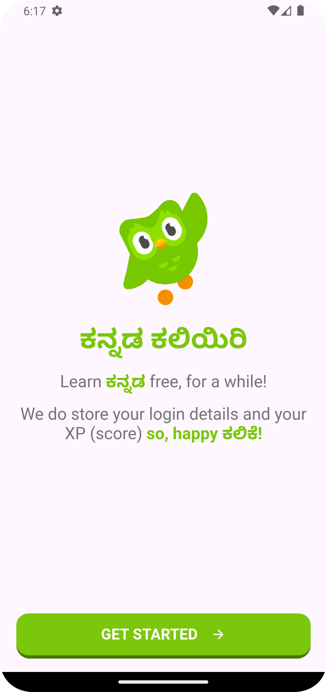
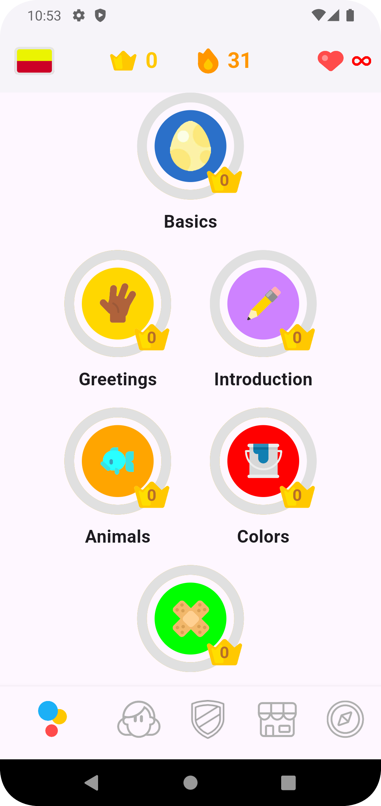
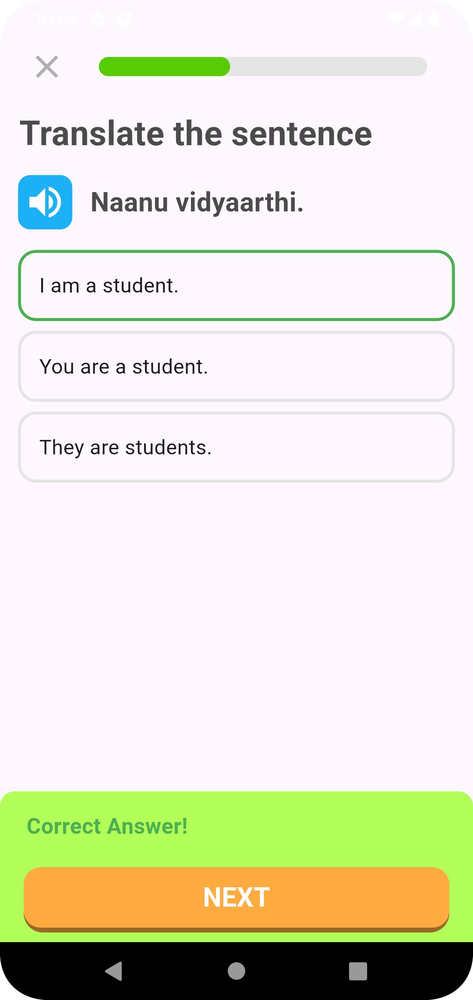

## Kannada Learning App - Duolingo Style


A personal language learning app to teach oneself Kannada, built using Flutter 3.22.0. This project focuses on delivering an engaging and interactive experience, similar to Duolingo, with the goal of making Kannada learning easy and enjoyable.

### Features

- **Game-Style Levels:** Learn Kannada through progressive levels stored in simple JSON files for easy modification and scalability.
- **Dependency Injection:** Utilizes `get_it` and `injectable` to manage dependencies and ensure clean architecture.
- **Routing:** Easy navigation through the app using `auto_route`.
- **State Management:** Efficient state management with the `provider` package to handle app state.

### Getting Started
For more detailed instructions and troubleshooting, please refer to the  file.

### Installation

1. Clone the repository:
   ```bash
   git clone https://github.com/rshrc/Words625
   ```
2. Navigate to the project directory:
   ```bash
   cd Words625
   ```
3. Install dependencies:
   ```bash
   flutter pub get
   ```
4. Build executable package:
   ```bash
   flutter pub run build_runner build --delete-conflicting-outputs
   ```
5. Run the app:
   ```bash
   flutter run
   ```

### Main Packages Used

- **get_it**: A simple service locator for dependency injection.
- **auto_route**: Provides a powerful and easy-to-use routing system.
- **provider**: For state management across the app.
- **injectable**: An annotation-based code generator for dependency injection.

### JSON Game Levels

Game levels are stored in simple JSON files, allowing easy creation and modification of levels without altering the app code. JSON files are parsed at runtime to dynamically generate learning content.

### Screenshots

| Screenshot 1                      | Screenshot 2                      | Screenshot 3                      |
|-----------------------------------|-----------------------------------|-----------------------------------|
|  |  |  |


### Future Enhancements

- Implement advanced learning modules with speaking and listening exercises.
- Add Fill in the blanks type game levels
- Expand the game level repository for a more comprehensive learning journey.
- Add support for learning Kannada script and pronunciation.
- Add image based learning exercises

All PR's and Contributions Welcome!

Join our dev community at [Discord](https://discord.gg/HqwnSZUmsz)!